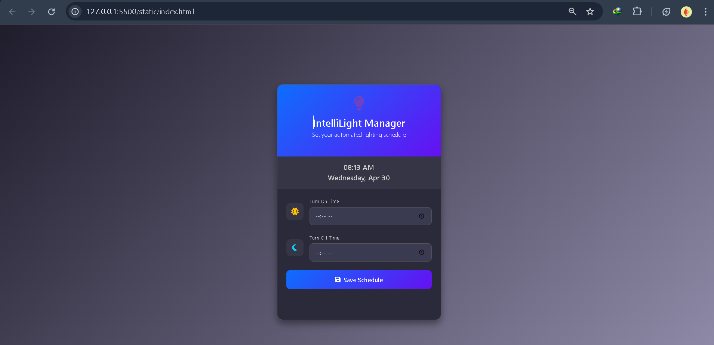

IntelliLight Scheduler 🕒💡
A modern web-powered system for scheduling and remotely managing an Arduino-controlled relay using MQTT and WebSocket technology.

🔍 Project Overview
IntelliLight Scheduler enables remote automation of a relay switch via a simple, elegant interface:

A user-friendly web dashboard to set lighting schedules

A WebSocket server that bridges the frontend with an MQTT broker

A Python-based MQTT subscriber that relays commands to an Arduino device

An Arduino sketch that toggles the relay to turn a connected light ON or OFF

🧩 Core Components
1. 🌐 Web Interface
Built with Bootstrap for a clean, responsive layout

Enables real-time scheduling via WebSocket

Easy-to-use time input for ON/OFF settings

2. 🔄 WebSocket Server (websocket_server.py)
Manages communication between browser and backend

Checks for scheduled tasks every 3 seconds

Publishes appropriate MQTT messages at the right time

3. 📥 MQTT Subscriber (subscriber.py)
Listens for MQTT messages

Communicates with Arduino over a serial connection

Provides detailed terminal logs for transparency and debugging

4. ⚡ Arduino Sketch (arduino/relay.ino)
Handles relay control via digital pin 7

Turns ON (LOW) or OFF (HIGH) the connected device

Includes debug output over Serial for monitoring


## Setup Requirements 📋

1. Hardware 🛠️:
   - Arduino board
   - Relay module connected to pin 7
   - USB connection between Arduino and computer

2. Software Dependencies 💻:
   - Python 3.x
   - Required Python packages (install via `pip install -r requirements.txt`):
     - paho-mqtt
     - pyserial
     - websockets
   - Arduino IDE for uploading the sketch
   - Modern web browser

## Configuration ⚙️

1. MQTT Broker:
   - Default broker IP: 157.173.101.159
   - Default port: 1883
   - Topic: relay/controll

2. Serial Communication:
   - Default port: /dev/ttyACM0
   - Baud rate: 9600

3. Web Interface:
   - HTTP server: http://localhost:8000
   - WebSocket server: ws://localhost:8765

## Usage 🚀

1. Upload the Arduino sketch to your board:
   ```bash
   # Using Arduino IDE, upload arduino/relay.ino
   ```

2. Install dependencies:
   ```bash
   pip install -r requirements.txt
   ```

3. Start the WebSocket server:
   ```bash
   python websocket_server.py
   ```

4. Start the MQTT subscriber:
   ```bash
   python subscriber.py
   ```

5. Open http://localhost:8000 in your web browser
6. Set your desired ON and OFF times and click Submit

## Debug Output 🔍

The system provides detailed logging at each step:

1. WebSocket Server:
   - Shows schedule reception and MQTT publishing
   - Logs schedule checking every 3 seconds

2. MQTT Subscriber:
   - Shows connection status
   - Logs command reception and forwarding
   - Displays Arduino responses

3. Arduino:
   - Confirms command reception
   - Shows relay state changes
   - Reports current light status

## Screenshots 📸

### Web Interface




## License 📄

This project is licensed under the MIT License - see the [LICENSE](LICENSE) file for details.

## Contributing 🤝

1. Fork the repository
2. Create your feature branch (`git checkout -b feature/AmazingFeature`)
3. Commit your changes (`git commit -m 'Add some AmazingFeature'`)
4. Push to the branch (`git push origin feature/AmazingFeature`)
5. Open a Pull Request

## Security Note 🔒

The MQTT broker IP is hardcoded for demonstration purposes. In a production environment, consider:
1. Using environment variables for sensitive configuration
2. Implementing MQTT authentication
3. Using TLS for MQTT and WebSocket connections

## Customization ✨

- Modify the web interface design in `static/style.css`
- Adjust schedule check frequency in `subscriber.py`
- Configure MQTT topics and broker settings in both Python scripts
